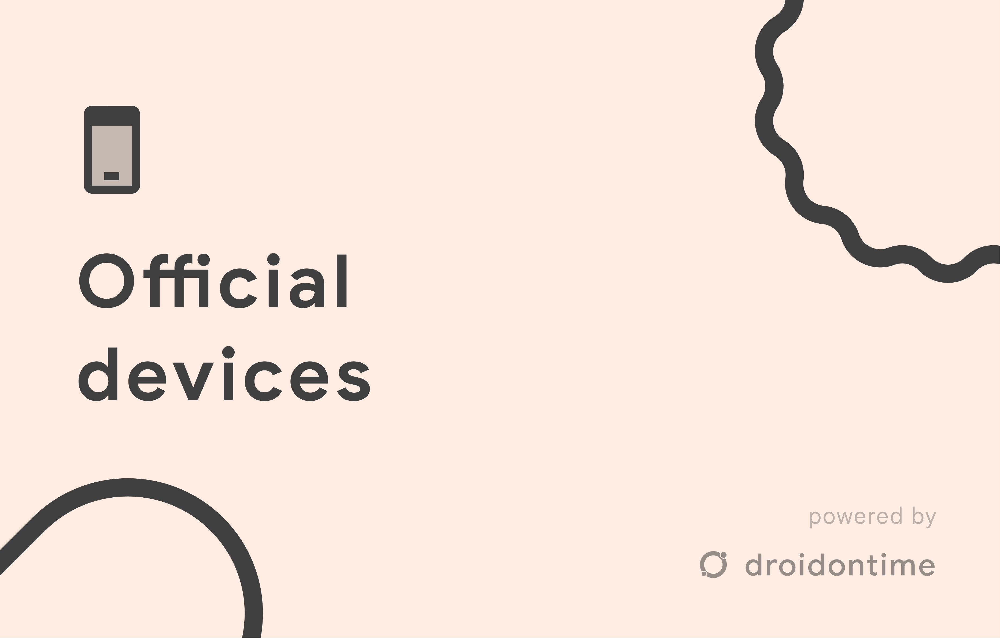

# dotOS | Official Devices

## Sending PRs

All PRs should be done by our gerrit @ [review.droidontime.com](https://review.droidontime.com). If PR will be made through GitHub, it will be closed without any notice.

## Example of new device

_Disclaimer: Remember to change values._

```json
{
	"codename": "lavender",
	"deviceName": "Redmi Note 7/7s",
	"brandName": "Xiaomi",
	"otaEnabled": true,
	"latestVersion": null,
	"discontinued": false,
	"deviceChangelog": null,
	"releases": null,
	"links": {
		"xda": "https://forum.xda-developers.com/t/rom-aosp-dotos-5-x-xiaomi-redmi-note-7-7s-lavender-official.4313249/",
		"telegram": "https://t.me/dotoslavender"
	},
	"maintainerInfo": {
		"name": "ririxi",
		"profileURL": "https://t.me/ririxii"
	}
}
```

Explanation:

- `codename` - Codename of your device. **REQUIRED**
- `deviceName` - Full name of your device. **REQUIRED**
- `brandName` - Brand of your device. **REQUIRED**
- `otaEnabled` - This value shouldn't be changed.
- `latestVersion` - This value shouldn't be changed. It's generated by our scripts.
- `discontinued` - This value shouldn't be changed.
- `deviceChangelog` - This value shouldn't be changed.
- `releases` - This value shouldn't be changed. It's generated by our scripts.
- `links`:
  - `xda` - XDA Link to post about your release.
    - If you can't do post about your release, please tell us and change value for it to `null` - _NOT STRING_.
  - `telegram` - Telegram link to your group/channel/profile. **REQUIRED**
- `maintainerInfo`:
  - `name` - Your displayed username on website. **REQUIRED**
  - `profileURL` - Your profile url. **REQUIRED**
